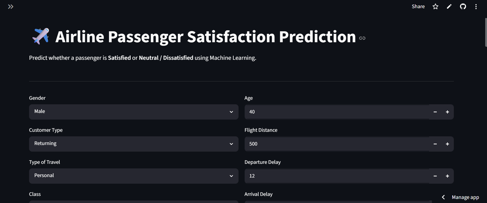
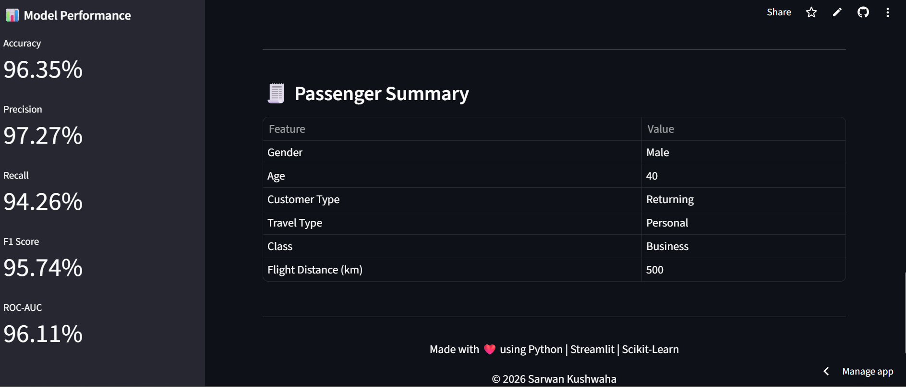

# ✈️ Airline Passenger Satisfaction Prediction

A Machine Learning web application that predicts whether an airline passenger is **Satisfied** or **Neutral / Dissatisfied** based on passenger details and service ratings.


🔗 **Live Demo:** https://sarwan-airline-prediction.streamlit.app

💻 **GitHub Repository:** https://github.com/Sarwan24/Airline-Passenger-Satisfaction-Prediction


## 📌 Project Overview

This project uses a **Random Forest Classifier** trained on an airline passenger satisfaction dataset. The model is deployed using **Streamlit**, allowing users to enter passenger information and receive real-time satisfaction predictions.

---

## 🚀 Features

- Predict passenger satisfaction instantly
- Interactive Streamlit web interface
- Confidence score for every prediction
- Random Forest Machine Learning model
- Responsive and user-friendly design

---

## 📊 Dataset Information

- **Dataset:** Airline Passenger Satisfaction
- **Total Records:** 129,487
- **Input Features:** 23
- **Target Variable:** Satisfaction

---

## 🤖 Machine Learning Model

- Algorithm: Random Forest Classifier
- Accuracy: **96.35%**
- Precision: **97.27%**
- Recall: **94.26%**
- F1 Score: **95.74%**
- ROC-AUC Score: **96.11%**

---

## 🛠️ Tech Stack

- Python
- Pandas
- NumPy
- Scikit-learn
- Joblib
- Streamlit

---

## 📂 Project Structure

```text
Airline-Passenger-Satisfaction-Prediction/
│
├── app.py
├── README.md
├── requirements.txt
├── Models/
│   └── airline_satisfaction_model.pkl
└── assets/
    ├── home.png
    ├── prediction_result.png
    ├── Model Informations & Services Rating
    └── passenger_summary.png
```

---

## ⚙️ Installation

### Clone the repository

```bash
git clone git clone https://github.com/Sarwan24/Airline-Passenger-Satisfaction-Prediction.git
```

### Move into the project

```bash
cd Airline_Passenger_Satisfaction
```

### Install dependencies

```bash
pip install -r requirements.txt
```

### Run the application

```bash
streamlit run app.py
```

---

## 📷 Application Preview


### 🏠 Home Page



---

### 🎯 Prediction Result & Mode Performance


---

### Model Informations & Services Rating


---

### 📊 Passenger Summary


---

## 🎯 Future Improvements

- PDF report download
- SHAP feature importance
- Prediction history
- Docker support
- Cloud deployment

---

## 🌐 Live Demo

https://sarwan-airline-prediction.streamlit.app

## 👨‍💻 Developer

**Sarwan Kushwaha**

- Data Science & AI/ML Enthusiast
- Python | Machine Learning | Deep Learning | Streamlit

---

## ⭐ If you like this project

Please give this repository a ⭐ on GitHub.